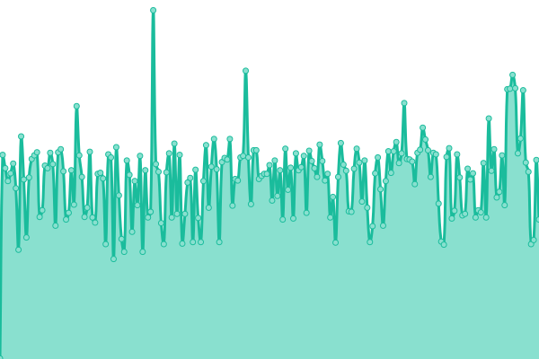
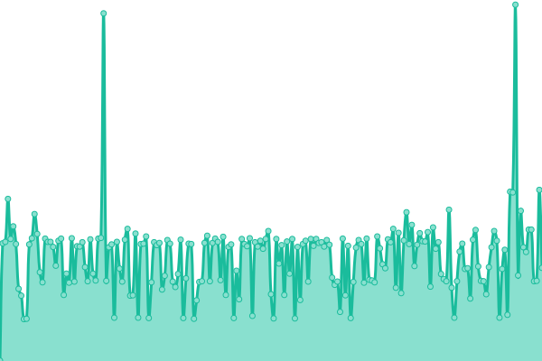
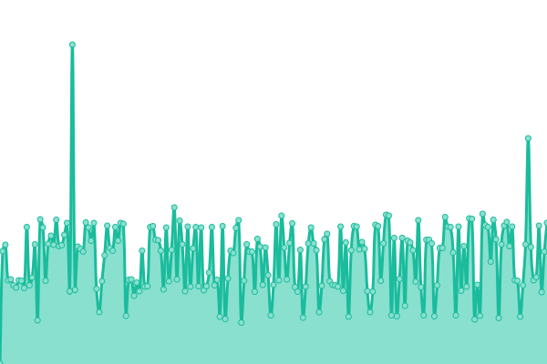
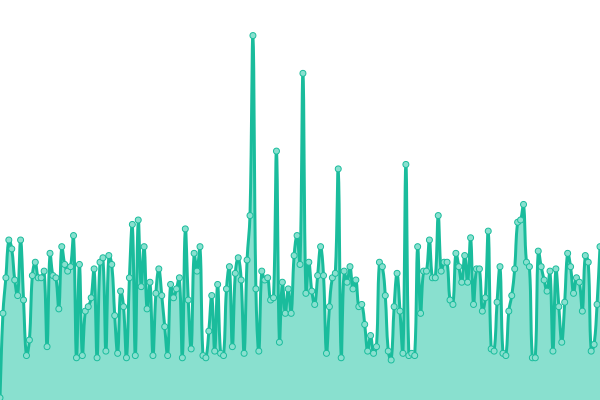
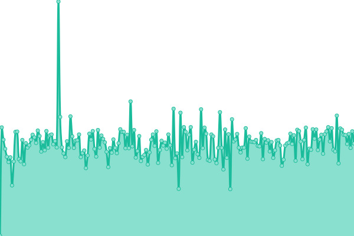
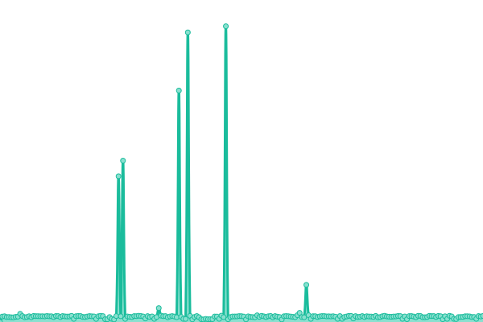
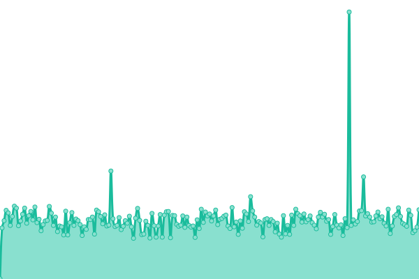
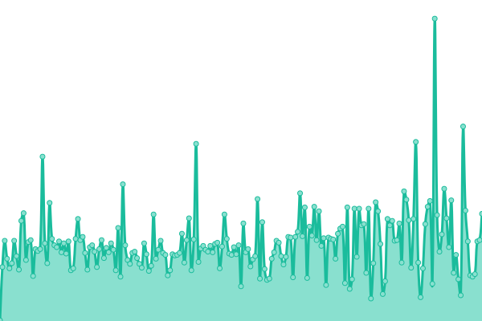
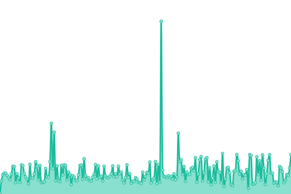

# [📈 Live Status](https://status.dnswarden.com): <!--live status--> **🟩 All systems operational**

This repository contains the open-source uptime monitor and status page for [dnswarden](https://dnswarden.com), powered by [Upptime](https://github.com/upptime/upptime).

With [Upptime](https://upptime.js.org), you can get your own unlimited and free uptime monitor and status page, powered entirely by a GitHub repository. We use [Issues](https://github.com/dnswarden/status/issues) as incident reports, [Actions](https://github.com/dnswarden/status/actions) as uptime monitors, and [Pages](https://status.dnswarden.com) for the status page.

<!--start: status pages-->
<!-- This summary is generated by Upptime (https://github.com/upptime/upptime) -->
<!-- Do not edit this manually, your changes will be overwritten -->
<!-- prettier-ignore -->
| URL | Status | History | Response Time | Uptime |
| --- | ------ | ------- | ------------- | ------ |
|  Asia Front-End | 🟩 Up | [asia-front-end.yml](https://github.com/dnswarden/status/commits/HEAD/history/asia-front-end.yml) | 

 353ms
     
 | 

<a href="https://status.dnswarden.com/history/asia-front-end">100.00%</a>
    

|  Asia Back-End | 🟩 Up | [asia-back-end.yml](https://github.com/dnswarden/status/commits/HEAD/history/asia-back-end.yml) | 

 292ms
     
 | 

<a href="https://status.dnswarden.com/history/asia-back-end">100.00%</a>
    

|  Europe Front-End | 🟩 Up | [europe-front-end.yml](https://github.com/dnswarden/status/commits/HEAD/history/europe-front-end.yml) | 

 327ms
     
 | 

<a href="https://status.dnswarden.com/history/europe-front-end">100.00%</a>
    

|  Europe Back-End | 🟩 Up | [europe-back-end.yml](https://github.com/dnswarden/status/commits/HEAD/history/europe-back-end.yml) | 

 230ms
     
 | 

<a href="https://status.dnswarden.com/history/europe-back-end">100.00%</a>
    

|  North America Front-End | 🟩 Up | [north-america-front-end.yml](https://github.com/dnswarden/status/commits/HEAD/history/north-america-front-end.yml) | 

 97ms
     
 | 

<a href="https://status.dnswarden.com/history/north-america-front-end">100.00%</a>
    

|  North America Back-End | 🟩 Up | [north-america-back-end.yml](https://github.com/dnswarden/status/commits/HEAD/history/north-america-back-end.yml) | 

 56ms
     
 | 

<a href="https://status.dnswarden.com/history/north-america-back-end">100.00%</a>
    

|  AU,Africa,SA Front-End | 🟩 Up | [au-africa-sa-front-end.yml](https://github.com/dnswarden/status/commits/HEAD/history/au-africa-sa-front-end.yml) | 

 356ms
     
 | 

<a href="https://status.dnswarden.com/history/au-africa-sa-front-end">100.00%</a>
    

|  AU,Africa,SA Back-End | 🟩 Up | [au-africa-sa-back-end.yml](https://github.com/dnswarden/status/commits/HEAD/history/au-africa-sa-back-end.yml) | 

 568ms
     
 | 

<a href="https://status.dnswarden.com/history/au-africa-sa-back-end">100.00%</a>
    

|  Search API | 🟩 Up | [search-api.yml](https://github.com/dnswarden/status/commits/HEAD/history/search-api.yml) | 

 212ms
     
 | 

<a href="https://status.dnswarden.com/history/search-api">100.00%</a>
    

|  Backup Front-End | 🟩 Up | [backup-front-end.yml](https://github.com/dnswarden/status/commits/HEAD/history/backup-front-end.yml) | 

 124ms
     
 | 

<a href="https://status.dnswarden.com/history/backup-front-end">100.00%</a>
    

|  Backup Back-End | 🟩 Up | [backup-back-end.yml](https://github.com/dnswarden/status/commits/HEAD/history/backup-back-end.yml) | 

 78ms
     
 | 

<a href="https://status.dnswarden.com/history/backup-back-end">100.00%</a>
    

<!--end: status pages-->

[**Visit our status website →**](https://status.dnswarden.com)

## 📄 License

- Powered by: [Upptime](https://github.com/upptime/upptime)
- Code: [MIT](./LICENSE) © [dnswarden](https://dnswarden.com)
- Data in the `./history` directory: [Open Database License](https://opendatacommons.org/licenses/odbl/1-0/)
